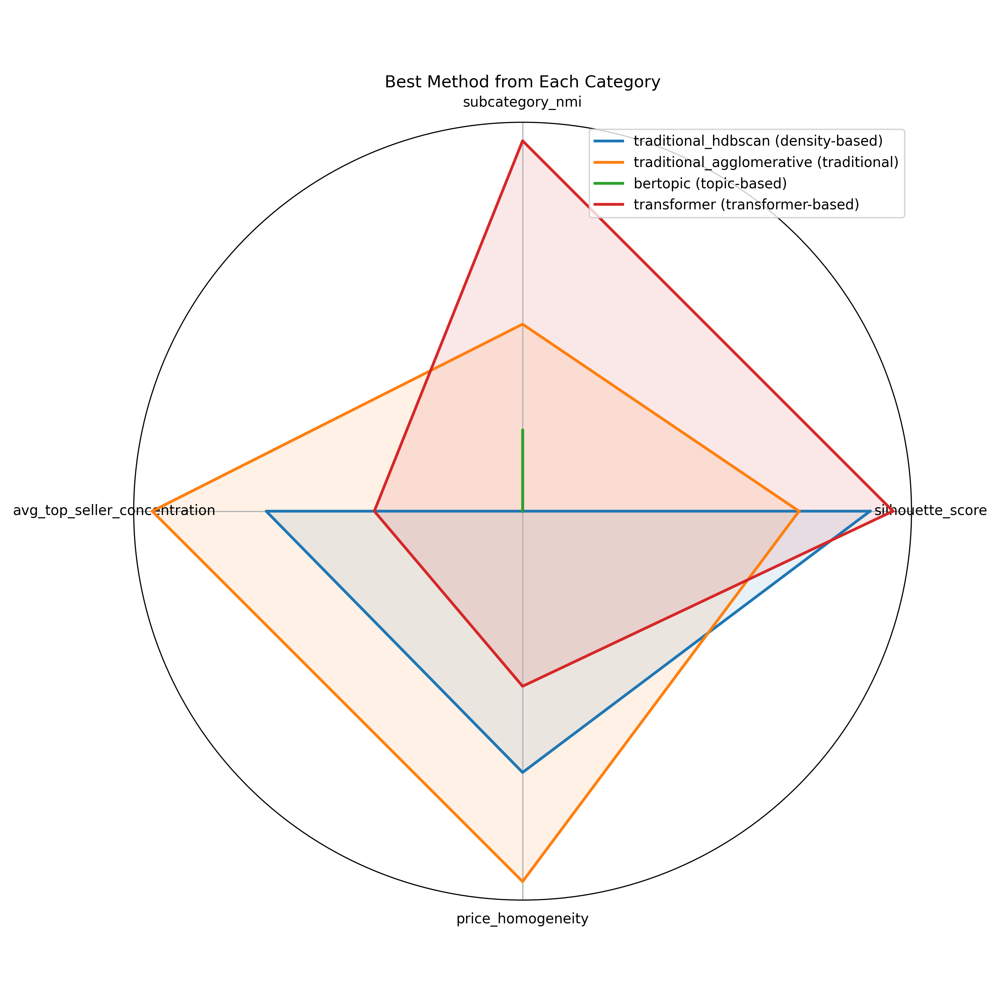
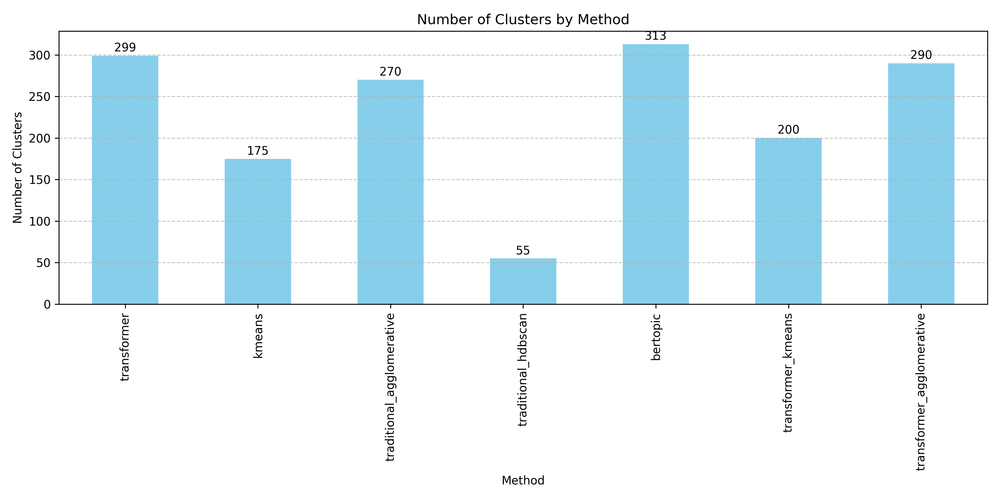
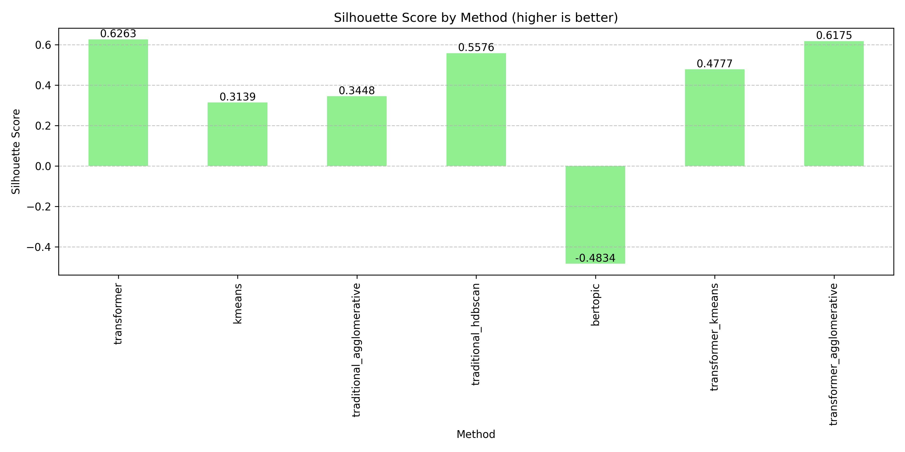
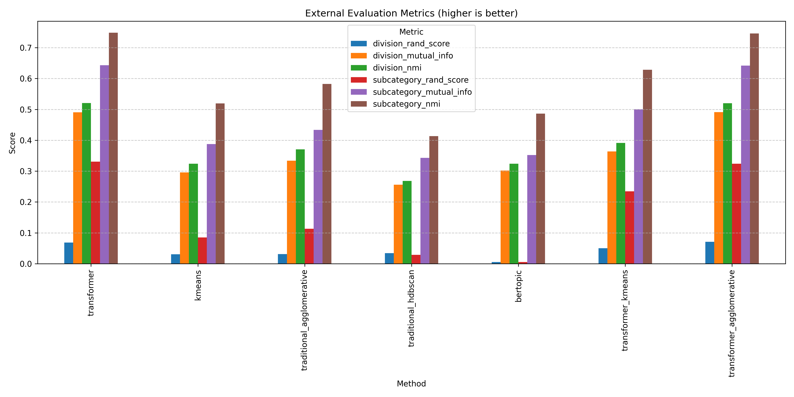
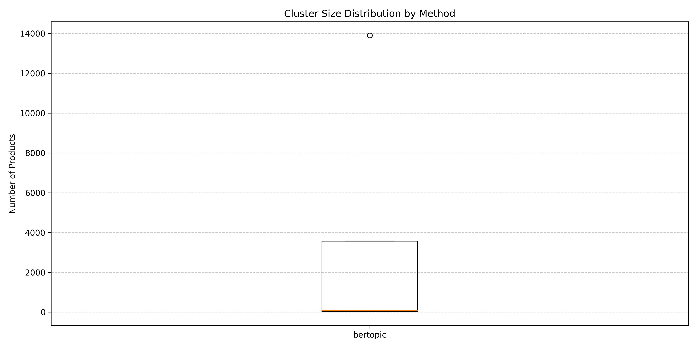
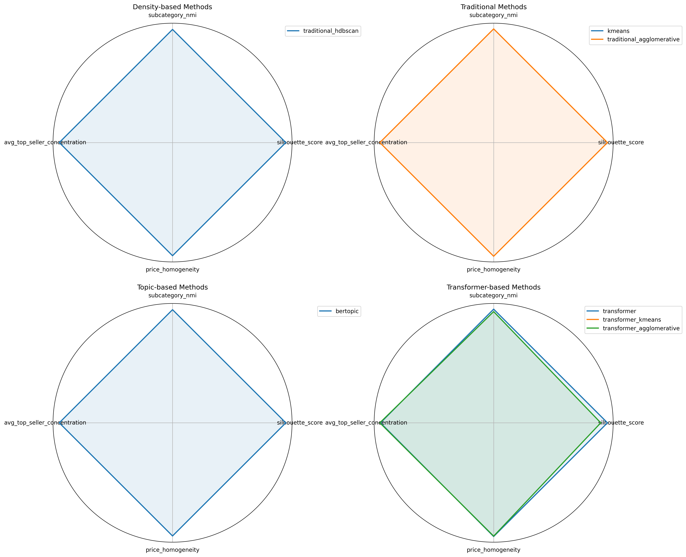

# E-Commerce Product Clustering

A comprehensive framework for automatically clustering e-commerce products using various machine learning approaches. This project implements and compares multiple clustering techniques to provide optimized product categorization for e-commerce applications.



## Table of Contents
- [Overview](#overview)
- [Key Results](#key-results)
- [Features](#features)
- [Requirements](#requirements)
- [Installation](#installation)
- [Usage](#usage)
- [Methods Available](#methods-available)
- [Evaluation](#evaluation)
- [Project Structure](#project-structure)
- [Detailed Results](#detailed-results)

## Overview

This project provides a comprehensive solution for clustering e-commerce products using various machine learning techniques. By leveraging both traditional and transformer-based approaches, it helps organize product catalogs automatically based on product descriptions, prices, and seller information.

## Key Results

After evaluating 7 different clustering methods, we found:

### Method Ranking
1. **traditional_agglomerative** (traditional): 17.85 points
2. **kmeans** (traditional): 16.06 points
3. **traditional_hdbscan** (density-based): 12.58 points
4. **transformer** (transformer-based): 9.18 points
5. **transformer_agglomerative** (transformer-based): 9.16 points
6. **transformer_kmeans** (transformer-based): 6.89 points
7. **bertopic** (topic-based): 5.62 points



## Features

- Multiple clustering methodologies (traditional, transformer-based, density-based)
- Comprehensive evaluation framework with internal and external metrics
- Business-oriented metrics (price homogeneity, seller concentration)
- Visual result comparisons
- Optimized for e-commerce product datasets

## Requirements

- Python 3.8+
- PyTorch
- scikit-learn
- Transformers
- HDBSCAN
- BERTopic
- Pandas
- NumPy
- Matplotlib

## Installation

```bash
# Clone the repository
git clone https://github.com/MatasMartinkus/E-Commerce-clusterisation.git
cd E-Commerce-clusterisation

# Create a virtual environment
python -m venv fresh

# Activate the environment
# On Windows
fresh\\Scripts\\activate
# On Unix or MacOS
source fresh/bin/activate

# Install dependencies
pip install -r requirements.txt
```

## Usage

### Running a Specific Clustering Method

```bash
# For traditional K-means clustering
python Kmeans_fast.py

# For transformer-based clustering
python Transformer_KMeans.py
```

### Running Evaluation

```bash
# Generate full evaluation report
python evaluation.py --generate-report

# Compare specific methods
python evaluation.py --methods traditional_agglomerative transformer_kmeans
```

## Methods Available

The project includes the following clustering approaches:

### Traditional Methods
- **K-Means**: Fast clustering using TF-IDF vectors
- **Agglomerative**: Hierarchical clustering with TF-IDF vectors

### Transformer-based Methods
- **Transformer K-Means**: K-Means applied to transformer embeddings
- **Transformer Agglomerative**: Hierarchical clustering with transformer embeddings

### Density-based Methods
- **HDBSCAN**: Density-based clustering for finding arbitrary shapes

### Topic-based Methods
- **BERTopic**: Topic modeling approach that combines transformers with clustering



## Evaluation

The evaluation framework measures:

- **Internal metrics**: Silhouette score, Calinski-Harabasz index
- **External metrics**: NMI with existing categories
- **Business metrics**: Price homogeneity, seller concentration

Run the evaluation with:
```bash
python evaluation.py --generate-report
```



## Project Structure

```
.
├── Kmeans_fast.py                # Traditional K-means implementation
├── Traditional_agglomerative.py  # Hierarchical clustering with TF-IDF
├── Traditional_hdbscan.py        # HDBSCAN with TF-IDF
├── Transformer_KMeans.py         # K-means with transformer embeddings
├── Transformer_HDBSCAN.py        # HDBSCAN with transformer embeddings
├── Bertopic.py                   # BERTopic implementation
├── evaluation.py                 # Evaluation framework
├── results/                      # Generated results
│   ├── kmeans/                   # K-means results
│   ├── transformer/              # Transformer results
│   └── evaluation/               # Evaluation outputs
├── evaluation/                   # Evaluation results
│   ├── charts/                   # Generated visualizations
│   ├── comparisons/              # Method comparison tables
│   ├── metrics/                  # Detailed metric reports
│   └── reports/                  # Comprehensive evaluation reports
└── requirements.txt              # Project dependencies
```

## Detailed Results

### Best Performing Method: traditional_agglomerative

Our evaluation found that traditional_agglomerative provides the best balance of cluster quality and alignment with product categories:

- **Silhouette score**: 0.3448
- **Subcategory NMI**: 0.5824
- **Number of clusters**: 270
- **Top seller concentration**: 0.8086
- **Price homogeneity**: 0.6892



### Recommendations

Based on the evaluation results, we recommend:

1. **Use traditional_agglomerative for production clustering** - Best overall performance
2. **Use transformer when semantic understanding is critical** - Better understanding of relationships
3. **Use traditional_agglomerative for large datasets** - More efficient and scalable
4. **Use traditional_hdbscan for identifying outlier products** - Better at finding unusual items
5. **Use bertopic when interpretable clusters are needed** - Provides representative keywords



### Specific Use Cases

- **For automatic catalog organization**: traditional_agglomerative
- **For matching existing categories**: transformer (highest subcategory alignment)
- **For pricing strategy development**: traditional_agglomerative (most homogeneous price clusters)
- **For seller-based analysis**: traditional_agglomerative (highest seller concentration in clusters)

For more detailed analysis, see the full evaluation report.
